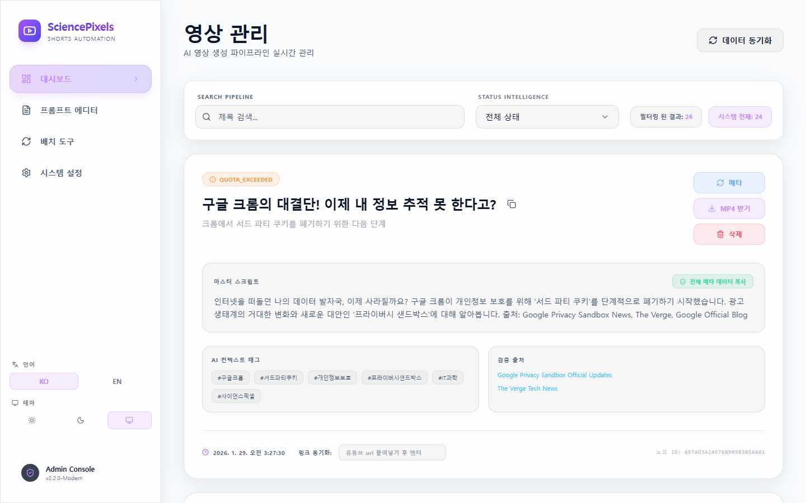
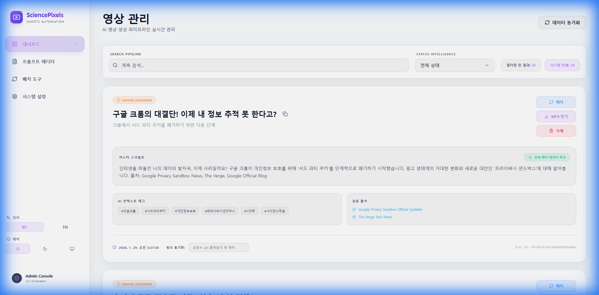
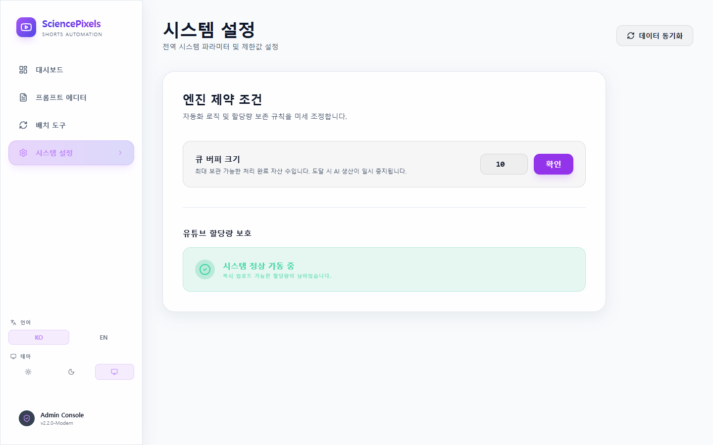
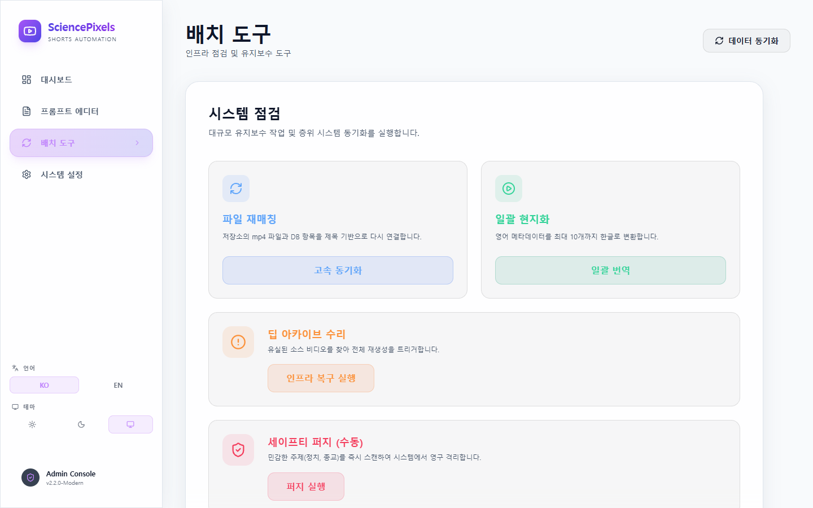
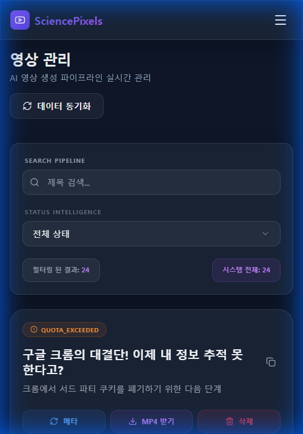
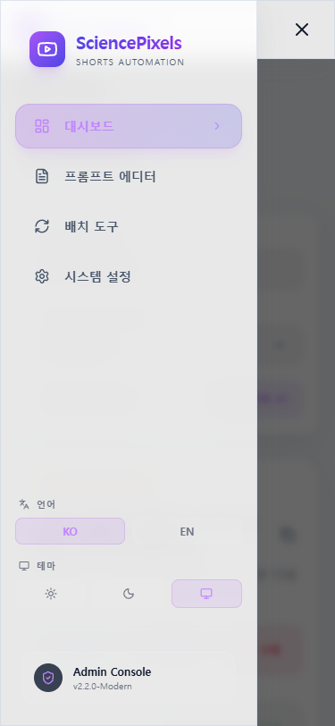
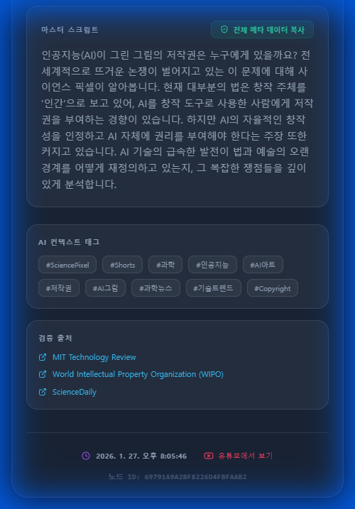

# 🧪 Science News Shorts Automation Project
> **Event-Driven AI Video Production Pipeline: From RSS to YouTube Shorts in 60 Seconds**

## 1. Project Overview
**"뉴스 수집부터 영상 업로드까지, 인간의 개입을 0으로 만든다면?"**

본 프로젝트는 최신 과학 뉴스 RSS 피드를 실시간으로 감지하여, 대본 작성(LLM), 나레이션(TTS), 배경음악(AI Music), 영상 편집(FFmpeg)을 거쳐 최종적으로 **YouTube Shorts**에 업로드하는 **완전 자동화(Zero-Touch) 파이프라인**입니다.

단순한 스크립트 실행이 아니라, **MSA(Microservices Architecture)** 패턴을 적용하여 확장성과 안정성을 확보하였으며, Google Gemini와 같은 최신 생성형 AI 모델을 실제 프로덕션 파이프라인에 통합한 사례입니다.

---

## 2. Tech Stack & Architecture

### 🛠️ Core Technology
| Category | Stack | Description |
| :--- | :--- | :--- |
| **Backend** | **Kotlin, Spring Boot 3.2** | 핵심 비즈니스 로직 및 오케스트레이션 |
| **Architecture** | **Event-Driven (Kafka)** | 서비스 간 비동기 통신 및 느슨한 결합 구현 |
| **Database** | **MongoDB** | 비정형 메타데이터(영상 정보, AI 프롬프트) 저장 |
| **AI Models** | **Gemini 1.5 Pro**, **MusicGen** | 대본 및 키워드 생성, 분위기별 BGM 생성 |
| **Media Engine** | **FFmpeg**, **Edge-TTS** | 고성능 영상 렌더링 및 음성 합성 |
| **Search** | **Pexels API** | 문맥 기반(Context-Aware) 영상 리소스 검색 매칭 |
| **Frontend** | **React (TypeSript)**, **Tailwind** | 시스템 모니터링 및 제어를 위한 관리자 대시보드 |
| **Infrastructure** | **Docker Compose**, **Tailscale** | 컨테이너 기반 배포 및 VPN을 통한 원격 보안 접속 |

### 🏗️ System Architecture Pipeline
```mermaid
graph TD
    subgraph "Ingestion Layer"
        RSS[News RSS Feeds] -->|Poller| Batch[Spring Batch]
        Batch -->|New Item Event| Kafka_In{Apache Kafka}
    end

    subgraph "Processing Logic"
        Kafka_In -->|Consume| Svc[Core Service (Kotlin)]
        Svc -->|1. Summarize & Script| Gemini[Google Gemini API]
        Svc -->|2. Search Assets| Pexels[Pexels Video API]
        Svc -->|3. Generate Voice| TTS[Edge-TTS]
        Svc -->|4. Generate BGM| Python_AI[AI Media Service]
    end

    subgraph "Production Engine"
        Svc -->|All Assets Ready| FFmpeg[FFmpeg Render Worker]
        FFmpeg -->|Merge & Crop| MP4[Final Video File]
    end

    subgraph "Delivery & Clean"
        MP4 -->|Scheduled Upload| Youtube[YouTube Data API]
        Youtube -->|Success/Quota| DB[(MongoDB History)]
        DB -->|Cleanup Policy| Trash[Resource Cleaner]
    end
```

---

## 3. Key Technical Challenges & Solutions

### 🛡️ Challenge 1: API Quota Management (429 Error)
**문제점**: 무료/Tier 등급의 YouTube API와 Gemini API는 분당/일일 요청 제한(Quota)이 엄격하여, 대량 처리 시 `429 Too Many Requests` 오류가 빈번함.
**해결책**: **Dual-Lock Quota Guard**
- **Token Bucket 알고리즘**과 유사한 자체 Rate Limiter 구현.
- **Gemini Guard**: 여러 개의 API 키를 로테이션하며 RPM(Requests Per Minute)을 실시간 추적.
- **Smart Scheduler**: 유튜브 업로드는 'One-by-One' 전략으로, 이전 업로드가 완료되고 할당량이 남았을 때만 다음 작업을 트리거하도록 설계.

### 🔄 Challenge 2: System Reliability (Self-Healing)
**문제점**: 외부 API(Pexels, TTS) 타임아웃이나 FFmpeg 렌더링 중단 등으로 인해 파일이 누락되거나 데이터 불일치 발생.
**해결책**: **Automated Healing Pipeline**
- 시스템 시작 시 및 주기적으로(Cron) **Deep Scan**을 수행하여 DB 메타데이터와 실제 파일 시스템을 대조.
- `FILE_NOT_FOUND` 상태 감지 시, 사용자의 개입 없이 자동으로 해당 단계부터 재시도(`REGENERATING`)하거나 필요한 리소스를 다시 다운로드(`Rematch`).

### 🎨 Challenge 3: Global & User Experience
**문제점**: 단순 로그 파일만으로는 시스템 상태를 파악하기 어렵고, 글로벌 서비스 확장(한/영) 고려 필요.
**해결책**: **Modern Admin Dashboard**
- **i18n Support**: 프론트엔드 레벨에서 동적 언어팩 로딩 (한국어/영어 즉시 전환).
- **Dynamic Theming**: CSS Variables 기반의 Glassmorphism UI로 Light/Dark 모드 완벽 지원.
- **PWA Excellence**: `beforeinstallprompt` 이벤트를 캡처하여 최적의 모바일 설치 경험 제공.

### 🛡️ Challenge 4: PWA Stability in HTTPS Environment
**문제점**: Tailscale VPN 등 HTTPS 보안 환경에서 서비스 워커 등록 오류 및 브라우저 설치 팝업 미노출 이슈 발생.
**해결책**: **Network-First Caching Strategy**
- 서비스 워커의 캐싱 전략을 'Network-First'로 최적화하여 갱신 지연 문제 해결.
- React 상태 관리를 통한 수동 설치 버튼 연동으로 모든 브라우저 환경에서 동일한 UX 보장.

### ⚡ Challenge 5: Scalable Background Processing
**문제점**: 영상 업로드와 같은 장시간 소요 작업이 메인 스레드를 점유하여 API 응답 속도가 저하되는 문제.
**해결책**: **Spring Async Orchestration**
- `@EnableAsync` 및 `@Async`를 도입하여 비동기 작업 스레드 풀 관리.
- 업로드 성공 시에만 디스코드 알림을 전송하는 트리거 세분화로 불필요한 알림 노이즈 제거.

---

## 4. UI/UX Screenshots

> **Note**: 현재 로컬 환경에서 실행 중이므로, 아래 경로에 스크린샷을 넣어주세요.

### 🖥️ Main Dashboard (Dark Mode)
**실시간 모니터링**: 현재 대기 중인 영상, 처리 상태(Processing, Uploaded), 오류 로그를 한눈에 파악.


### ☀️ Light Mode & Responsive Design
**가독성 최적화**: 밝은 환경에서도 명확하게 정보를 전달하는 최적화된 색상 테마. 모바일에서도 완벽하게 동작하므로 이동 중 관리 가능.


### ⚙️ Intelligence Settings
**엔진 제어**: 큐 버퍼 사이즈 조정, 업로드 차단 해제 시간 설정, 긴급 멈춤(Kill Switch) 기능.


### 🛠️ Batch Tools
**수동 제어 도구**: 누락 파일 재매칭, 메타데이터 대량 번역, 리소스 강제 정리 등 관리자 전용 유틸리티.


### 📱 Mobile Responsive Experience
**Anytime, Anywhere**: 모바일 환경(`375x812`)에서도 깨짐 없는 완벽한 반응형 레이아웃을 제공합니다. 햄버거 메뉴와 세로형 카드 리스트를 통해 이동 중에도 시스템을 제어할 수 있습니다.

| Main View | Mobile Menu | Content List |
| :---: | :---: | :---: |
|  |  |  |

---

## 5. Evolution Highlights

- [x] **Phase 1**: 기본 파이프라인 구축 (RSS -> FFmpeg -> YouTube)
- [x] **Phase 2**: AI 고도화 (Gemini 1.5 적용, BGM 생성기 도입)
- [x] **Phase 3**: 안정성 강화 (Quota Guard, Self-Healing)
- [x] **Phase 4**: Admin Dashboard 구축 (React, Glassmorphism)
- [x] **Phase 5**: 글로벌 & 보안 (i18n, Tailscale VPN)
- [x] **Phase 6**: 백엔드 안정화 및 리팩토링 (v2.2.0) - 데이터 모델 구조 개선 및 컴파일 최적화
- [x] **Phase 7**: 모바일 고도화 및 안정성 강화 (v2.3.0) - PWA 도입, 비동기 처리 최적화, 자동 할당량 복구 로직 구현

---

**Author**: sprtms16
**Repository**: [GitHub Link](https://github.com/sprtms16/science-news-shorts-automation)
