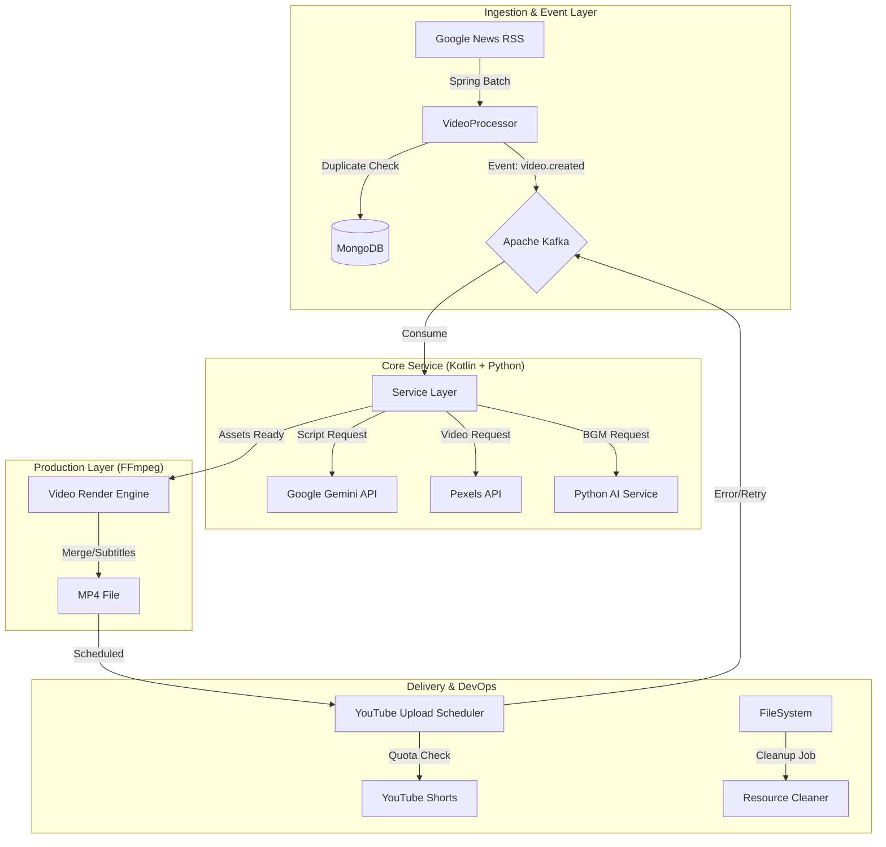

# 🧪 Science News Shorts Automation
> **AI 기반 과학 뉴스 쇼츠 자동 생성 및 업로드 파이프라인 구축 프로젝트**

[]() [-red)]() []() []()

## 📖 Project Overview
매일 쏟아지는 최신 과학 뉴스를 1분 내외의 **숏폼(Shorts) 영상**으로 **완전 자동화(Fully Automated)** 하여 제작하고 YouTube에 업로드하는 시스템입니다.
뉴스 수집부터 대본 작성, 리소스(영상/이미지) 확보, 나레이션(TTS), 배경음악(BGM) 생성, 영상 편집(FFmpeg), 그리고 최종 업로드까지 사람의 개입 없이 24시간 운영됩니다.

## 🚀 Key Features
- **Zero-Touch Automation**: RSS 피드 수집부터 유튜브 업로드까지 전 과정 자동화.
- **AI-Powered Content Creation**:
  - **Scripting**: Google Gemini 1.5 Pro를 활용하여 뉴스 요약 및 쇼츠 전용 대본/키워드 생성.
  - **Voice**: Microsoft Edge-TTS를 사용한 자연스러운 한국어 나레이션.
  - **Audio**: Text-to-Music (MusicGen) 모델을 활용하여 분위기에 맞는 BGM 생성 및 매칭.
- **Dynamic Video Production**:
  - **FFmpeg Pipeline**: 자막(SRT) 생성, 하드코딩(Burning), 오디오 믹싱, 영상 크롭(9:16) 자동화.
  - **Smart Resource Matching**: 대본의 문맥(Context)을 분석하여 Pexels API에서 최적의 영상 클립 매칭.
- **Robust Architecture**:
  - **EDA (Event-Driven Architecture)**: Kafka를 활용한 비동기 메시지 처리로 대량의 트래픽에도 안정적.
  - **Reliability**:
    - **Circuit Breaker**: YouTube API Quota 초과 시 즉시 차단 및 자동 복구.
    - **Self-Healing**: 파일 손상이나 누락 시 자동으로 감지하여 재생성(Regeneration).
    - **Cleanup**: 업로드 완료된 리소스 및 임시 파일을 주기적으로 정리하여 디스크 효율화.

## 🛠️ System Architecture
시스템은 크게 **Ingestion(수집) - Processing(가공) - Production(제작) - Delivery(배포)** 의 4단계 파이프라인으로 구성되어 있습니다.



## 🔧 Tech Stack
### Backend & Core
- **Language**: Kotlin (JDK 17)
- **Framework**: Spring Boot 3.2, Spring Batch
- **Database**: MongoDB (Metadata History)
- **Message Broker**: Apache Kafka (Confluent Platform)

### AI & Media Processing
- **LLM**: Google Gemini 1.5 (Script & Metadata Generation)
- **Voice**: Edge-TTS (Neural Text-to-Speech)
- **Audio AI**: Hugging Face `facebook/musicgen-small` (Python Microservice)
- **Video Engine**: FFmpeg (Clipping, Filtering, Rendering)

### DevOps & Infrastructure
- **Container**: Docker, Docker Compose
- **Scheduling**: Spring Scheduler (Cron)

## 💡 Smart Logic Highlights
### 1. Quota-Aware Scheduling
YouTube API의 일일 할당량(Quota) 제한을 고려하여, **'One-by-One'** 방식의 순차 업로드를 구현했습니다. `403 Forbidden` 에러 발생 시 회로 차단기(Circuit Breaker)가 작동하여 불필요한 API 호출을 막고 다음 주기를 기다립니다.

### 2. Self-Healing Regeneration
네트워크 오류나 FFmpeg 렌더링 실패로 인해 결과물이 누락된 경우 (`FILE_NOT_FOUND`), 시스템이 이를 감지하고 스스로 재생성(`REGENERATING`) 프로세스를 트리거하여 데이터 무결성을 유지합니다.

### 3. Automated Cleanup
서버 디스크 공간 관리를 위해 업로드가 확인된(`UPLOADED`) 영상과 1시간 이상 경과한 임시 작업 폴더(`workspace_*`)를 매시 30분마다 자동으로 청소합니다.

## 📝 Usage (Manual Trigger)
자동 스케줄러 외에도 API를 통해 수동으로 제어할 수 있습니다.
```bash
# 수동 업로드 트리거
POST /manual/scheduler/trigger

# 리소스 청소 트리거
POST /manual/cleanup/trigger

# 특정 주제로 영상 생성 요청
POST /manual/batch/topic
{
  "topics": ["Quantum Computing", "Black Hole"],
  "style": "news"
}
```

---
*Created by SciencePixel Automation Team*
