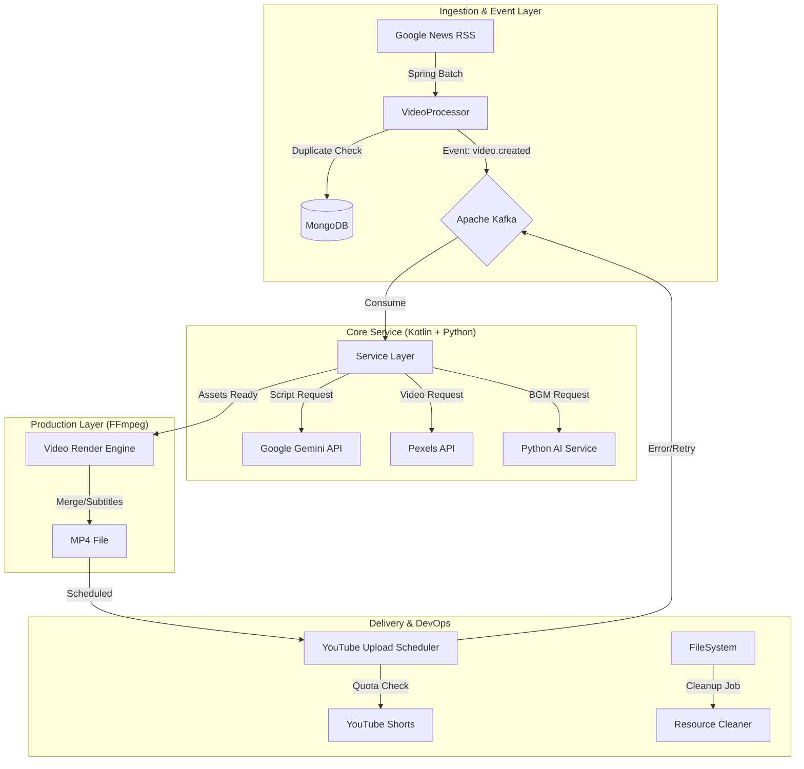

# 🧪 Science News Shorts Automation
> **AI 기반 과학 뉴스 쇼츠 자동 생성 및 업로드 파이프라인 구축 프로젝트**

[]() [-red)]() []() []()

## 📖 Project Overview
매일 쏟아지는 최신 과학 뉴스를 1분 내외의 **숏폼(Shorts) 영상**으로 **완전 자동화(Fully Automated)** 하여 제작하고 YouTube에 업로드하는 시스템입니다.
뉴스 수집부터 대본 작성, 리소스(영상/이미지) 확보, 나레이션(TTS), 배경음악(BGM) 생성, 영상 편집(FFmpeg), 그리고 최종 업로드까지 사람의 개입 없이 24시간 운영됩니다.

## 🚀 Key Features
- **Zero-Touch Automation**: RSS 피드 수집부터 유튜브 업로드까지 전 과정 자동화.
- **AI-Powered Content Creation**:
  - **Scripting**: Google Gemini 1.5 Pro를 활용하여 뉴스 요약 및 쇼츠 전용 대본/키워드 생성.
  - **Voice**: Microsoft Edge-TTS를 사용한 자연스러운 한국어 나레이션.
  - **Audio**: Text-to-Music (MusicGen) 모델을 활용하여 분위기에 맞는 BGM 생성 및 매칭.
- **Dynamic Video Production**:
  - **FFmpeg Pipeline**: 자막(SRT) 생성, 하드코딩(Burning), 오디오 믹싱, 영상 크롭(9:16) 자동화.
  - **Smart Resource Matching**: 대본의 문맥(Context)을 분석하여 Pexels API에서 최적의 영상 클립 매칭.
- **Advanced Admin Dashboard (React)**:
  - **Monitoring**: 영상 제작 및 업로드 상태 실시간 모니터링 및 필터링/검색 지원.
  - **Maintenance**: 유튜브 링크 동기화, 메타데이터 재생성, 누락 파일 복구 등 매뉴얼 도구 제공.
  - **Settings**: 동적 버퍼 제한(최대 생성 개수) 및 업로드 차단 해제 시간 설정.
- **Robust Architecture**:
  - **Dual-Lock Quota Guard**: Gemini API 및 YouTube API의 쿼터를 실시간으로 추적하며 최적의 생성 속도 유지.
  - **Self-Healing**: 파일 손상이나 누락 시 자동으로 감지하여 재생성(Regeneration).
  - **Cleanup**: 업로드 완료된 리소스 및 1시간 이상 정체된 작업을 주기적으로 정리하여 디스크 효율화.

## 🛠️ System Architecture
시스템은 크게 **Ingestion(수집) - Processing(가공) - Production(제작) - Delivery(배포)** 의 4단계 파이프라인으로 구성되어 있습니다.



## 💻 Tech Stack
### Backend & Core
- **Language**: Kotlin (JDK 17)
- **Framework**: Spring Boot 3.2, Spring Batch
- **Database**: MongoDB (Metadata History)
- **Message Broker**: Apache Kafka (Confluent Platform)

### AI & Media Processing
- **LLM**: Google Gemini 1.5 (Script & Metadata Generation)
- **Voice**: Microsoft Edge-TTS (Neural Text-to-Speech)
- **Audio AI**: Hugging Face `facebook/musicgen-small` (Python Microservice)
- **Video Engine**: FFmpeg (Clipping, Filtering, Rendering)

### DevOps & Infrastructure
- **Container**: Docker, Docker Compose
- **Scheduling**: Spring Scheduler (Cron)

## 📦 Installation & Setup

### Prerequisites
- Docker & Docker Compose
- Java 17+ (for local development)
- Google Cloud Project (YouTube Data API v3, Gemini API enabled)
- Pexels API Key

### Configuration
1. **Clone Repository**
   ```bash
   git clone https://github.com/sprtms16/science-news-shorts-automation.git
   cd science-news-shorts-automation
   ```

2. **API Keys Setup**
   - `tokens/` 디렉토리에 YouTube OAuth2 자격 증명 파일(`StoredCredential`)이나 `client_secret.json`을 위치시킵니다.
   - Pexels 및 Gemini API Key는 환경 변수 또는 설정 파일에 입력합니다.

3. **Build & Run (Docker)**
   전체 시스템은 Docker Compose로 구성되어 있어 한 번의 명령으로 실행 가능합니다.
   ```bash
   # Build and Start all services
   docker-compose up -d --build
   ```

4. **Verify Services**
   - **Controller API**: `http://localhost:8080/swagger-ui.html` (if enabled) or check logs.
   - **Kafka UI** (Optional): `http://localhost:9000` (if configured).

## 💡 Smart Logic Highlights
### 1. Quota-Aware Scheduling & Gemini Guard
- YouTube API의 일일 할당량(Quota) 제한을 고려하여, **'One-by-One'** 방식의 순차 업로드를 구현했습니다.
- **Gemini Guard**: 다중 API 키를 활용하여 RPM/TPM/RPD를 실시간 추적하며, 429 에러 없이 안정적으로 대본을 생성합니다.

### 2. Dual-Lock Buffer Management
- **Strict Limit**: 업로드되지 않은 영상이 10개를 초과하지 않도록 2단계(Scheduler + Processor)에서 정밀하게 체크합니다.
- **Auto-Sync**: 수동으로 유튜브 링크를 입력하더라도 즉시 카운트에서 제외되어 제작 파이프라인이 유동적으로 재개됩니다.

### 3. Self-Healing & Deep Repair
- 네트워크 오류나 FFmpeg 렌더링 실패로 인해 결과물이 누락된 경우 (`FILE_NOT_FOUND`), 시스템이 이를 감지하고 스스로 재생성(`REGENERATING`) 프로세스를 트리거합니다.
- **Deep Repair**: DB와 파일 시스템 간의 불일치를 일괄적으로 해결하고 영어 제목을 한글로 복원하는 강력한 관리 도구를 제공합니다.

### 4. Automated Cleanup & Safety
- 서버 디스크 공간 관리를 위해 업로드 완료된 건과 1시간 이상 정체된 실패 작업을 매시 30분마다 자동으로 청소합니다.
- **Safety Filter**: Gemini AI를 통해 정치/종교 등 민감한 주제의 뉴스를 생성 단계에서 1차로, 완료 후 2차로 교차 검열하여 채널 안정성을 확보합니다.

## 📝 Usage (Manual Trigger)
자동 스케줄러 외에도 API를 통해 수동으로 제어할 수 있습니다.
```bash
# 수동 업로드 트리거
POST /manual/scheduler/trigger

# 리소스 청소 트리거
POST /manual/cleanup/trigger

# 특정 주제로 영상 생성 요청
POST /manual/batch/topic
{
  "topics": ["Quantum Computing", "Black Hole"],
  "style": "news"
}
```

---
*Created by sprtms16*
