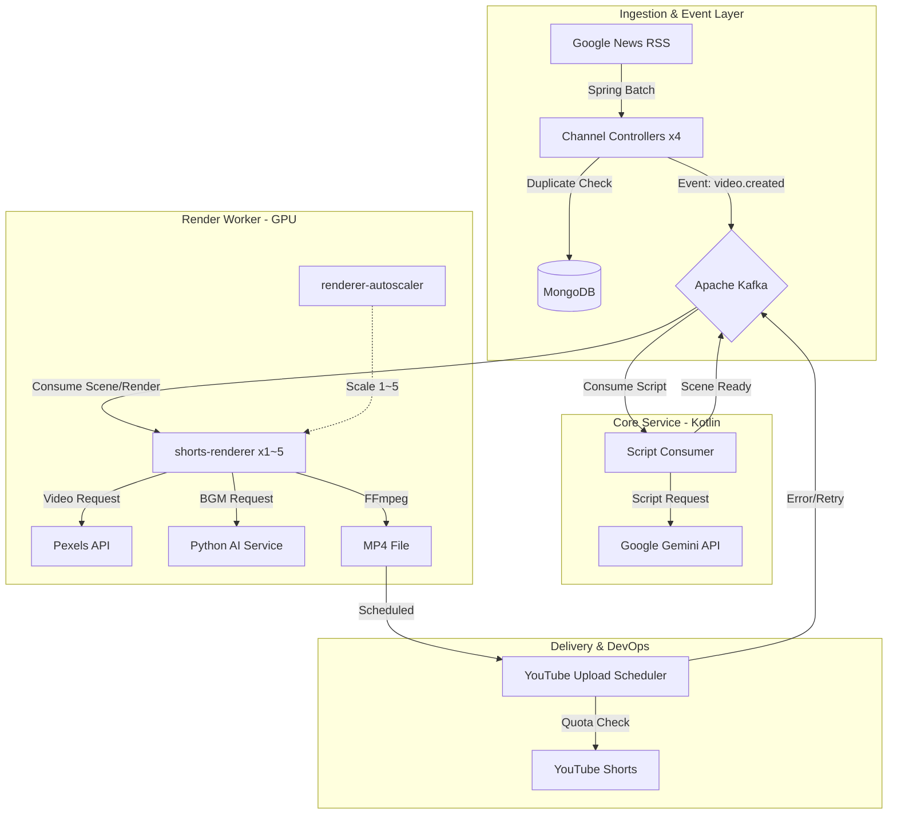

# 🧪 Science News Shorts Automation

> **AI 기반 멀티채널 쇼츠 자동 생성 및 업로드 파이프라인 구축 프로젝트**

[]()
[-red)]()
[]()
[]()
[]()
[]()
[]()

---

## 📖 Project Overview

매일 쏟아지는 최신 뉴스를 1분 내외의 **숏폼(Shorts) 영상**으로 **완전 자동화(Fully Automated)** 하여 제작하고 YouTube에 업로드하는 시스템입니다.

뉴스 수집부터 대본 작성, 리소스(영상/이미지) 확보, 나레이션(TTS), 배경음악(BGM) 생성, 영상 편집(FFmpeg), 그리고 최종 업로드까지 사람의 개입 없이 **24시간 무인 운영**됩니다.

### 운영 채널

| 채널 | 주제 | 스케줄 | 포트 |
|------|------|--------|------|
| 🔬 **Science** | 과학/우주 뉴스 | 매시 10분, 40분 배치 | 8080 |
| 👻 **Horror** | 미스터리/공포 | 매시 20분, 50분 배치 | 8081 |
| 📈 **Stocks** | 주식/경제 뉴스 | 매일 17:30 배치 → 18~19시 업로드 | 8083 |
| 📜 **History** | 역사 이야기 | 매일 06:30 배치 → 07~08시 업로드 | 8084 |

---

## 🚀 Key Features

- **Zero-Touch Automation**: RSS 피드 수집부터 유튜브 업로드까지 전 과정 자동화.
- **AI-Powered Content Creation**:
  - **Scripting**: Google Gemini 2.5 Flash를 활용하여 뉴스 요약 및 쇼츠 전용 대본/키워드 생성.
  - **Voice**: Microsoft Edge-TTS를 사용한 자연스러운 한국어 나레이션.
  - **Audio**: `facebook/musicgen-small` 모델로 분위기에 맞는 BGM 생성 및 매칭 (GPU 가속).
- **Dynamic Video Production**:
  - **FFmpeg Pipeline**: 자막(SRT) 생성, 하드코딩(Burning), 오디오 믹싱, 영상 크롭(9:16) 자동화.
  - **Smart Resource Matching**: 대본의 문맥(Context)을 분석하여 Pexels API에서 최적의 영상 클립 매칭.
  - **Auto Scaling**: Kafka 큐 부하에 따라 렌더러 컨테이너를 1~5개로 동적 오토스케일링.
- **Advanced Admin Dashboard (React)**:
  - **Monitoring**: 영상 제작 및 업로드 상태 실시간 모니터링 및 필터링/검색 지원.
  - **Maintenance**: 유튜브 링크 동기화, 메타데이터 재생성, 누락 파일 복구 등 매뉴얼 도구 제공.
  - **Settings**: 동적 버퍼 제한(최대 생성 개수) 및 업로드 차단 해제 시간 설정.
  - **Internationalization (i18n)**: 한글/영어(KO/EN) 실시간 전환 및 자동 감지 지원.
  - **Dynamic Theming**: Light/Dark/System 테마 모드 및 Glassmorphism 디자인.
  - **Progressive Web App (PWA)**: 모바일 설치 지원 및 Offline-First 아키텍처.
- **Robust Architecture**:
  - **Dual-Lock Quota Guard**: Gemini API 및 YouTube API의 쿼터를 실시간으로 추적하며 최적의 생성 속도 유지.
  - **Self-Healing**: 파일 손상이나 누락 시 자동으로 감지하여 재생성(Regeneration) 프로세스 트리거.
  - **Cleanup**: 업로드 완료된 리소스 및 1시간 이상 정체된 작업을 주기적으로 정리하여 디스크 효율화.
  - **Safety Filter**: Gemini AI를 통해 정치/종교 등 민감한 주제를 생성 단계(1차) 및 완료 후(2차) 교차 검열.

---

## 🛠️ System Architecture

시스템은 크게 **Ingestion(수집) → Processing(가공) → Production(제작) → Delivery(배포)** 의 4단계 파이프라인으로 구성되어 있습니다.



---

## 💻 Tech Stack

### Backend & Core
| 항목 | 기술 |
|------|------|
| **Language** | Kotlin (JDK 17) |
| **Framework** | Spring Boot 3.2, Spring Batch, Spring Kafka |
| **Database** | MongoDB (Metadata) |
| **Message Broker** | Apache Kafka (Confluent 7.5.0) + Zookeeper |

### AI & Media Processing
| 항목 | 기술 |
|------|------|
| **LLM** | Google Gemini 2.5 Flash (대본 & 메타데이터 생성) |
| **Voice** | Microsoft Edge-TTS (Neural TTS) |
| **Audio AI** | `facebook/musicgen-small` via Hugging Face (Python / CUDA 12.1) |
| **Video Engine** | FFmpeg (클리핑, 자막, 믹싱, 렌더링) |
| **Stock Video** | Pexels API |

### DevOps & Infrastructure
| 항목 | 기술 |
|------|------|
| **Container** | Docker, Docker Compose |
| **CI/CD** | GitHub Actions + Self-hosted Runner |
| **VPN/Tunnel** | Tailscale (원격 관리 대시보드 접근) |
| **Scheduling** | Spring Scheduler (Cron) |
| **Notification** | Discord Webhook |

---

## 💾 System Requirements

### 서비스별 메모리 할당

| 서비스 | 역할 | 메모리 한도 |
|--------|------|------------|
| `github-runner` | CI/CD Self-hosted Runner | 4 GB |
| `kafka` | 이벤트 브로커 (heap 2GB) | 4 GB |
| `ai-media-service` | TTS + BGM 생성 (GPU) | 8 GB |
| `shorts-renderer` | 영상 렌더링 워커 (GPU, JVM 6GB) | **20 GB** |
| `mongo` | 메타데이터 DB | 2 GB |
| `shorts-science/horror/stocks/history` | 채널 컨트롤러 (JVM 512MB each) | 768 MB × 4 = **3 GB** |
| `shorts-log-service` | 로그 수집 (JVM 512MB) | 512 MB |
| `zookeeper` | Kafka 코디네이터 | 1 GB |
| `renderer-autoscaler` | 오토스케일러 | 256 MB |
| `frontend-server` | React 관리 대시보드 | 256 MB |
| `tailscale` | VPN 터널 | 256 MB |
| **합계** | | **≈ 44 GB** |

> **참고:** `shorts-renderer`는 오토스케일러에 의해 최대 5개까지 병렬 실행될 수 있습니다. (최대 100 GB RAM + GPU)

---

### ⚠️ 최소 사양 (Minimum Requirements)

> 이 사양은 단일 채널(science만 활성화)과 렌더러 1개 기준이며, BGM AI 없이 운영하는 최소 구성입니다.

| 항목 | 최소 사양 |
|------|----------|
| **OS** | Ubuntu 22.04 LTS / Debian 12 (Linux 권장) |
| **CPU** | 4코어 이상 (x86_64) |
| **RAM** | **32 GB** |
| **Storage** | **100 GB SSD** (OS + Docker 이미지 + 영상 버퍼) |
| **GPU** | NVIDIA GPU (VRAM 8 GB 이상, CUDA 12.1 지원) |
| **NVIDIA Driver** | 525 이상 (CUDA 12.1 지원) |
| **Docker** | Docker 24.0+ / Docker Compose v2.20+ |
| **Network** | 50 Mbps 이상 (영상 다운로드 + YouTube 업로드) |
| **Java** | JDK 17+ (로컬 개발 시) |

---

### ✅ 권장 사양 (Recommended Requirements)

> 4개 채널 전체 + 렌더러 오토스케일링(최대 3개) + GitHub Actions 배포 기준의 안정적인 운영 사양입니다.

| 항목 | 권장 사양 |
|------|----------|
| **OS** | Ubuntu 22.04 LTS (Server) |
| **CPU** | **8코어 이상** (Intel i7-12세대 / AMD Ryzen 7 5800X 이상) |
| **RAM** | **64 GB** DDR4 3200MHz 이상 |
| **Storage (OS/App)** | 128 GB NVMe SSD |
| **Storage (Data)** | 500 GB+ HDD/SSD (shared-data 볼륨, 영상/오디오 파일) |
| **GPU** | NVIDIA RTX 3070 이상 (VRAM **12 GB 이상**) |
| **NVIDIA Driver** | 535 이상 |
| **Docker** | Docker 26.0+ / Docker Compose v2.27+ |
| **Network** | 100 Mbps 이상 (대칭, YouTube 업로드 병렬 대응) |
| **Java** | JDK 17+ (로컬 개발 시) |

---

### 🔥 고성능 사양 (렌더러 5개 풀 스케일링)

> `renderer-autoscaler`가 렌더러를 5개까지 확장하는 최대 부하 기준 사양입니다.

| 항목 | 고성능 사양 |
|------|-----------|
| **CPU** | 16코어 이상 |
| **RAM** | **128 GB** 이상 |
| **GPU** | NVIDIA RTX 3090 / A4000 이상 (VRAM 24 GB 이상) |
| **Storage** | 1 TB NVMe SSD + 2 TB HDD |

---

## 📦 Installation & Setup

### Prerequisites

- Docker & Docker Compose v2.20+
- Java 17+ (로컬 개발 시)
- NVIDIA GPU + NVIDIA Container Toolkit (GPU 가속 필수)
- Google Cloud Project (YouTube Data API v3, Gemini API 활성화)
- Pexels API Key

### NVIDIA Container Toolkit 설치 (Ubuntu)

```bash
# NVIDIA Container Toolkit 설치
curl -fsSL https://nvidia.github.io/libnvidia-container/gpgkey | sudo gpg --dearmor -o /usr/share/keyrings/nvidia-container-toolkit-keyring.gpg
curl -s -L https://nvidia.github.io/libnvidia-container/stable/deb/nvidia-container-toolkit.list | \
  sed 's#deb https://#deb [signed-by=/usr/share/keyrings/nvidia-container-toolkit-keyring.gpg] https://#g' | \
  sudo tee /etc/apt/sources.list.d/nvidia-container-toolkit.list
sudo apt-get update && sudo apt-get install -y nvidia-container-toolkit
sudo nvidia-ctk runtime configure --runtime=docker
sudo systemctl restart docker
```

### Configuration

1. **Clone Repository**
   ```bash
   git clone https://github.com/sprtms16/science-news-shorts-automation.git
   cd science-news-shorts-automation
   ```

2. **환경 변수 설정**
   ```bash
   cp .env.example .env
   # .env 파일을 열어 실제 API 키 입력
   ```

   | 변수명 | 설명 |
   |--------|------|
   | `GEMINI_API_KEY` | Google Gemini API 키 |
   | `PEXELS_API_KEY` | Pexels Stock Video API 키 |
   | `TAILSCALE_AUTHKEY` | Tailscale 인증 키 (원격 접근) |
   | `DISCORD_WEBHOOK_URL` | Discord 알림 웹훅 URL |
   | `GITHUB_PAT` | GitHub Personal Access Token (Self-hosted Runner용) |
   | `SECRET_*_B64` | 채널별 YouTube OAuth Client Secret (Base64 인코딩) |

   **YouTube Secret Base64 인코딩 방법:**
   ```bash
   echo -n '{"installed": {...}}' | base64 -w 0
   ```

3. **YouTube OAuth 자격 증명 배치**
   - `backend/client_secret/` 디렉토리에 채널별 `client_secret.json` 위치

4. **Build & Run (Docker)**
   ```bash
   docker-compose up -d --build
   ```

5. **Verify Services**
   - **Admin Dashboard**: `http://localhost:3000` 또는 Tailscale IP
   - **Science API**: `http://localhost:8080`
   - **Horror API**: `http://localhost:8081`
   - **Log Service**: `http://localhost:8082`
   - **Stocks API**: `http://localhost:8083`
   - **History API**: `http://localhost:8084`

---

## 🚀 Deployment

이 프로젝트는 **GitHub Actions 자동 배포**와 **로컬 수동 배포** 두 가지 방식을 모두 지원합니다.

### GitHub Actions 자동 배포

`develop` 브랜치에 Push하면 자동으로 배포가 실행됩니다.

```bash
git add .
git commit -m "feat: your changes"
git push origin develop
```

**배포 프로세스:**
1. Self-hosted runner가 코드 변경 감지
2. Docker 이미지 빌드 (병렬 처리)
3. 서비스 재시작 (`github-runner` 제외)
4. Discord로 배포 완료 알림

### 로컬 수동 배포 스크립트

| 스크립트 | 용도 |
|----------|------|
| `./deploy-services.sh` | Runner 제외 전체 서비스 재배포 (GitHub Actions와 동일) |
| `./deploy-runner.sh` | GitHub Actions Runner만 재시작 |
| `./deploy-all.sh` | Runner 포함 전체 시스템 재배포 (초기 설정 시) |

```bash
chmod +x deploy-services.sh
./deploy-services.sh
```

모든 배포 스크립트는 다음 기능을 제공합니다:
- ✅ `.env` 파일 존재 여부 자동 확인
- ✅ Docker 이미지 병렬 빌드로 배포 속도 최적화
- ✅ 오래된 이미지 자동 정리 (디스크 공간 절약)
- ✅ 배포 완료 후 서비스 상태 자동 출력

### 배포 후 확인

```bash
# 모든 서비스 상태 확인
docker-compose ps

# 특정 서비스 로그 확인
docker-compose logs -f shorts-science
docker-compose logs -f shorts-renderer

# GPU 사용 확인
docker exec -it shorts-renderer nvidia-smi
```

---

## 💡 Smart Logic Highlights

### 1. Quota-Aware Scheduling & Gemini Guard
- YouTube API의 일일 할당량(Quota) 제한을 고려하여 **'One-by-One'** 방식의 순차 업로드를 구현했습니다.
- **Gemini Guard**: 다중 API 키를 활용하여 RPM/TPM/RPD를 실시간 추적하며, 429 에러 없이 안정적으로 대본을 생성합니다.

### 2. Dual-Lock Buffer Management
- **Strict Limit**: 업로드되지 않은 영상이 10개를 초과하지 않도록 2단계(Scheduler + Processor)에서 정밀하게 체크합니다.
- **Auto-Sync**: 수동으로 유튜브 링크를 입력하더라도 즉시 카운트에서 제외되어 제작 파이프라인이 유동적으로 재개됩니다.

### 3. Self-Healing & Deep Repair
- 네트워크 오류나 FFmpeg 렌더링 실패로 인해 결과물이 누락된 경우(`FILE_NOT_FOUND`), 시스템이 이를 감지하고 스스로 재생성(`REGENERATING`) 프로세스를 트리거합니다.
- **Deep Repair**: DB와 파일 시스템 간의 불일치를 일괄적으로 해결하는 강력한 관리 도구 제공.
- **Quota Recovery**: 할당량 초과(`QUOTA_EXCEEDED`)로 멈춘 영상들을 자동 감지하여 할당량 초기화 시점에 맞춰 스마트하게 재시도합니다.

### 4. Dynamic Renderer Auto-Scaling
- Kafka의 `video.scene` 토픽 큐 깊이를 모니터링하여 렌더러 컨테이너를 **1~5개**로 동적 확장/축소합니다.
- **Scale-up 조건**: 큐 5개 초과 → **Scale-down 조건**: 큐 2개 미만
- **Cooldown**: 스케일 변동 후 60초간 대기하여 과도한 진동(Oscillation) 방지.

### 5. Automated Cleanup & Safety
- 서버 디스크 공간 관리를 위해 업로드 완료된 건과 1시간 이상 정체된 실패 작업을 매시 30분마다 자동으로 청소합니다.
- **Safety Filter**: Gemini AI를 통해 정치/종교 등 민감한 주제의 뉴스를 2단계로 교차 검열하여 채널 안정성을 확보합니다.

---

## 📂 Project Structure

```
root/
├── backend/
│   ├── shorts-api/         # Spring Boot API (채널 컨트롤러 공용 이미지)
│   ├── shorts-core/        # Kotlin 공유 서비스 라이브러리 (Gemini, FFmpeg, Pexels 등)
│   ├── shorts-worker/      # 렌더러 워커 (FFmpeg 실행, GPU 가속)
│   ├── shorts-log-service/ # Kafka 로그 수집 서비스
│   ├── ai-media-service/   # Python FastAPI (Edge-TTS + MusicGen)
│   ├── autoscaler/         # 렌더러 오토스케일러
│   ├── market-collector/   # 주식 데이터 수집기
│   └── Dockerfile.kotlin
├── frontend/               # React Admin Dashboard (PWA)
├── nginx/                  # Nginx 설정
├── tailscale-config/       # Tailscale VPN 설정
├── vpn-state/              # Tailscale 상태 볼륨
├── shared-data/            # 마운트 볼륨 (영상, 오디오 에셋)
├── deploy-all.sh           # 전체 배포 스크립트
├── deploy-services.sh      # 서비스 배포 스크립트
├── deploy-runner.sh        # Runner 재시작 스크립트
├── docker-compose.yml      # 메인 Docker Compose
└── README.md
```

---

## 📝 Usage (Manual Trigger)

자동 스케줄러 외에도 API를 통해 수동으로 제어할 수 있습니다.

```bash
# 수동 업로드 트리거
POST http://localhost:8080/manual/scheduler/trigger

# 리소스 청소 트리거
POST http://localhost:8080/manual/cleanup/trigger

# 특정 주제로 영상 생성 요청
POST http://localhost:8080/manual/batch/topic
{
  "topics": ["Quantum Computing", "Black Hole"],
  "style": "news"
}

# YouTube 링크 수동 동기화
POST http://localhost:8080/manual/youtube/sync

# 누락 파일 복구
POST http://localhost:8080/manual/repair/deep
```

---

*Created by sprtms16 | Last updated: 2026-02-19*
